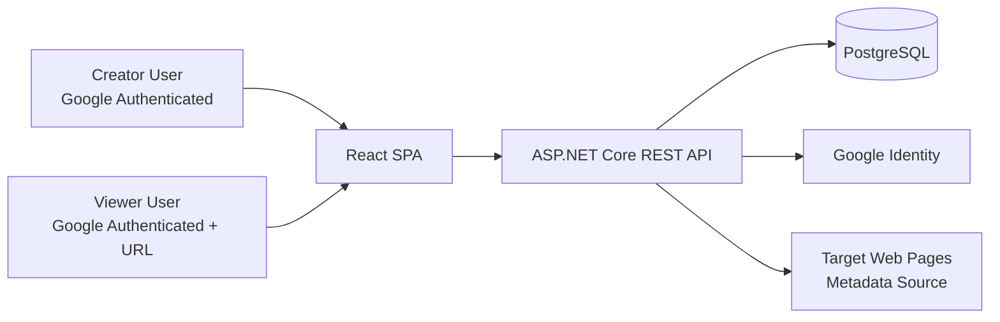
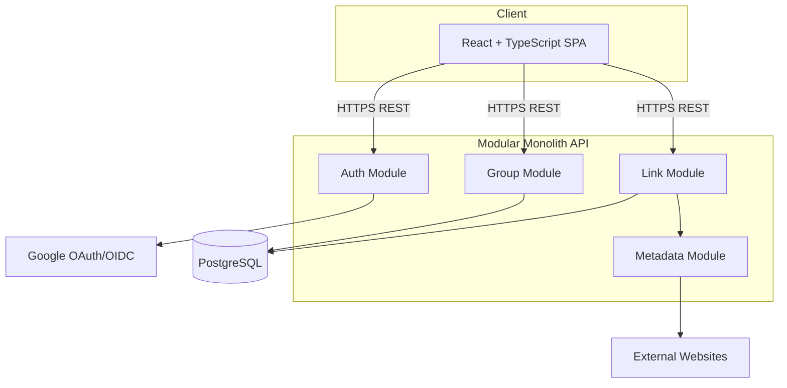
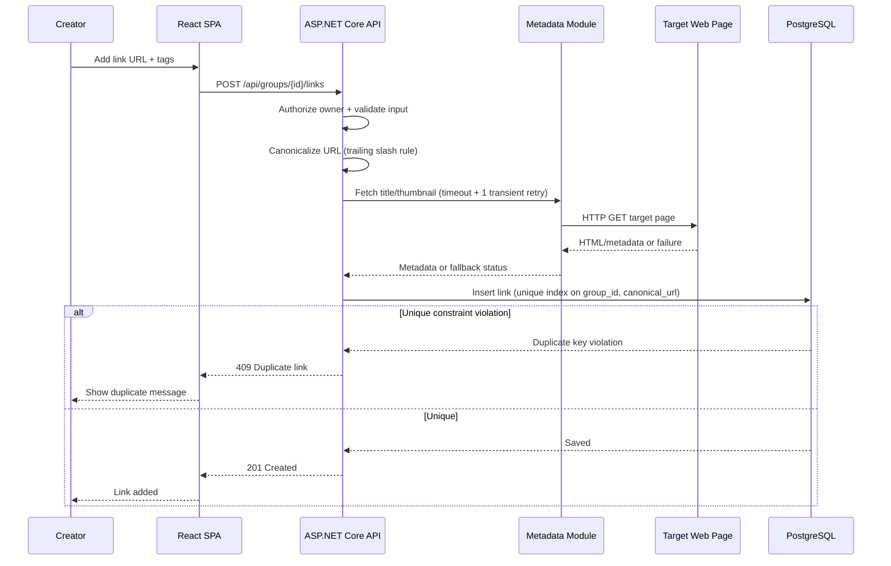

# Architecture

## 1. Executive Summary

This v1 solution is a modular monolith designed for a localhost portfolio project. It uses a React + TypeScript frontend, an ASP.NET Core REST API backend (.NET 10, C#), EF Core for data access, and PostgreSQL for persistence.

The architecture prioritizes simple user flows, clear ownership boundaries, and secure-by-default access control (Google-authenticated users only). It intentionally avoids distributed complexity (microservices, async event meshes, CQRS) because those are not justified by scope.

## 2. Architectural Drivers

### Business and Product Drivers

- Organize shared links into tidy topic-based groups.
- Share groups through unlisted URLs.
- Keep v1 small, usable, and demonstrable on localhost.

### Functional Drivers (from requirements)

- Google authentication required before any interaction.
- Creator can create group with title and description.
- Creator can add links with URL and tags.
- System fetches link title and thumbnail/logo metadata automatically.
- Only creator can edit a group and its links.
- Any Google-authenticated user with URL can view published group.
- Duplicate links prevented within group using trailing-slash normalization.

### Non-Functional Drivers

- Simple, low-friction UX.
- Graceful degradation when metadata fetch fails.
- Privacy by unlisted URL and no discovery/indexing in v1.
- Basic observability and debuggability for local development.

### Constraints

- Localhost-only v1.
- Portfolio/learning scope.
- Default stack: .NET 10, C#, ASP.NET Core REST API, EF Core, PostgreSQL, React, TypeScript.

### Requirement-to-Decision Traceability

| Requirement / Constraint | Architectural Decision |
|---|---|
| Google-authenticated access for all features | API enforces JWT bearer authentication issued after Google OAuth login; all endpoints require auth |
| Creator-only edit rights | Resource-level authorization checks on group owner id in API layer |
| Unlisted URL access for viewers | Group route uses opaque share token/slug; no listing/discovery endpoint |
| Duplicate rule with trailing slash handling | Canonical URL column and unique index `(group_id, canonical_url)` |
| Metadata fetch should not block link creation | Metadata fetch in resilient application service with timeout/fallback |
| v1 localhost simplicity | Modular monolith, single API + single DB + SPA |

## 3. System Context

The system serves two user roles in v1 behavior terms: group creators and authenticated viewers with shared URLs. External dependencies are Google Identity for authentication and public web pages for metadata extraction.

- Creators authenticate via Google, then create/edit their groups.
- Viewers authenticate via Google and can view unlisted groups via URL.
- Backend owns all authorization decisions and persistence.

## 4. Proposed Architecture

### Architectural Style

- Modular monolith with clean module boundaries inside one deployable backend.
- SPA frontend calling REST API over HTTPS on localhost.
- Synchronous request/response flows for v1.

### Major Backend Modules

- Identity/Auth Module:
  - Google OAuth integration, user profile upsert, JWT issuance, and token validation configuration.
- Group Module:
  - Group CRUD, publish state, share token generation/validation, ownership checks.
- Link Module:
  - Link add/remove/list, duplicate detection, tags handling, metadata orchestration.
- Metadata Module:
  - External page fetch/parsing for title and thumbnail/logo extraction with timeout and fallback.

### Why This Fits v1

- Meets all requirements without introducing unnecessary operational burden.
- Keeps logic centralized for easier learning and debugging.
- Leaves clear seams for future extraction (metadata worker, search service) if scale or reliability needs grow.

## 5. Backend Architecture (.NET 10, C#, EF Core, PostgreSQL)

### API Shape

- REST endpoints scoped by resource:
  - `/api/auth/*`
  - `/api/groups/*`
  - `/api/groups/{groupId}/links/*`
  - `/api/shared/{shareToken}` for read-only access by authenticated users.
- v1 intentionally excludes discovery endpoints (for example, no global public listing endpoint).

### Layering

- Presentation layer: controllers + request validation + auth policies.
- Application layer: use-case services (create group, add link, publish group, view shared group).
- Domain layer: entities/value rules (ownership, duplicate policy).
- Infrastructure layer: EF Core repositories, PostgreSQL mappings, metadata HTTP client.

### Authorization Model

- Global authenticated requirement.
- Policy `IsGroupOwner` for mutating routes, implemented via ASP.NET Core authorization handler that reads `groupId` from route values and validates `owner_user_id` against authenticated user id claim.
- Read access to shared group when caller is authenticated and presents valid share token.

### Error Handling

- Standard API error envelope.
- Validation errors: 400.
- Unauthorized/forbidden: 401/403.
- Not found: 404.
- Metadata fetch failures do not fail link creation; response indicates metadata status.

### Reliability Strategy (v1)

- Metadata fetch runs inline during link creation with a 4 second timeout per attempt.
- Retry policy: one retry on transient HTTP/network failures with exponential backoff (250 ms base), capped to 8 seconds total request budget.
- If both attempts fail or timeout, link creation still succeeds with `metadata_status = "unavailable"`.
- Circuit-breaker style behavior can be deferred unless external fetch instability is observed.

## 6. Frontend Architecture (React, TypeScript)

### Frontend Shape

- Single-page React app with route-based pages:
  - Login callback/entry
  - My groups
  - Group detail/edit (owner)
  - Shared group view (read-only)

### State Strategy

- Server-state centric data fetching for groups/links.
- Thin local UI state for forms and interactions.
- Auth state persisted for localhost v1 using browser localStorage for bearer JWT and user identity payload.

### UX Rules

- Block all pages behind authenticated flow.
- Show clear permissions in UI (owner edit actions vs viewer read-only).
- Metadata fetch status shown non-blockingly while preserving successful link creation.

## 7. Data Architecture

### Core Entities

- `User`
  - `id`, `google_subject`, `email`, `display_name`, timestamps.
- `Group`
  - `id`, `owner_user_id`, `title`, `description`, `is_published`, `share_token`, timestamps.
- `Link`
  - `id`, `group_id`, `url`, `canonical_url`, `title`, `thumbnail_url`, metadata status, timestamps.
- `LinkTag`
  - `id`, `link_id`, `tag`.

### Data Ownership and Integrity

- Group owns links.
- User owns groups.
- Canonical URL generated at write time with explicit v1 normalization rules:
  - Preserve scheme (`http` and `https` remain distinct).
  - Lowercase host.
  - Remove only a trailing slash from path for comparison.
  - Preserve query string, fragment, port, and `www` prefix as-is.
- Unique constraint on `(group_id, canonical_url)` is the source-of-truth duplicate guard under concurrency.
- Application handles unique constraint violations by returning 409 duplicate response.
- `LinkTag` enforces uniqueness per link with case-insensitive normalization (no duplicate tags that differ only by letter case).

### Migration and Transaction Strategy

- EF Core migrations for schema evolution.
- Single-transaction writes for group/link mutations.

## 8. Security and Access Control

- Authentication: Google OAuth/OIDC.
- Authentication transport for v1: JWT bearer tokens for SPA/API calls.
- Authorization:
  - All endpoints require authenticated principal.
  - Mutations require owner check.
  - Shared view requires valid share token and authentication.
- Share token strategy:
  - Token format: 64-character URL-safe random token generated with .NET `RandomNumberGenerator`.
  - Storage: persisted in `Group.share_token` with DB index for lookup.
  - Lifetime: non-expiring in v1.
  - Rotation/revocation: intentionally deferred to v1.1.
- Input validation on all write endpoints.
- Secrets handling:
  - Local development secrets via `.NET user-secrets` as the default mechanism.
  - Environment variables supported for containerized local runs.
  - No secrets hard-coded in source.
- Privacy:
  - No public browse/list endpoint.
  - `robots.txt` and non-indexing headers are optional for localhost but documented for future hosted environments.

## 9. Observability and Operational Concerns

- Structured logs with correlation id per request.
- Health endpoints for API and DB connectivity.
- Basic metrics (request count, latency, metadata fetch success/failure).
- Local troubleshooting guidance:
  - Distinguish auth failures, authorization failures, metadata fetch failures, and DB failures.
- Minimum log fields for v1 diagnostics: `correlation_id`, `user_id_hash`, `group_id` (when available), `route`, `status_code`, `error_code`, `duration_ms`.

## 10. Deployment View

### v1 Localhost Topology

- React dev server (or static host) on localhost.
- ASP.NET Core API on localhost.
- PostgreSQL local instance/container.

### Configuration

- Environment-based config for API base URL, OAuth client id/secret, DB connection string.
- Separate local dev config profile.

## 11. Key Decisions and Tradeoffs

1. Modular monolith instead of microservices.
   - Benefit: minimal complexity, fast delivery, easier debugging.
   - Tradeoff: less independent scaling/deployment per capability.
2. Synchronous metadata fetching during link creation with graceful fallback.
   - Benefit: immediate feedback and simpler flow.
  - Tradeoff: adds request latency and dependency on third-party page availability; bounded retry policy increases tail latency.
3. Database-enforced duplicate prevention via canonical URL unique index.
   - Benefit: strong integrity under concurrency.
  - Tradeoff: canonicalization changes later require migration strategy.
4. Unlisted share token + authenticated viewers.
   - Benefit: stronger privacy than anonymous unlisted access.
   - Tradeoff: extra login step for viewers.
5. JWT bearer authentication for localhost SPA/API integration.
  - Benefit: simple API security model and straightforward local testing.
  - Tradeoff: token handling on client must be explicit and consistent.

## 12. Risks and Mitigations

- Risk: Metadata fetch is slow/unreliable.
  - Mitigation: 4 second timeout per attempt, one transient retry with bounded backoff, fallback metadata state, optional future async job.
- Risk: Incorrect URL canonicalization causes false duplicates or misses.
  - Mitigation: explicit v1 normalization algorithm, canonicalization test cases, evolve rules in v2 with migration plan.
- Risk: Authorization bugs expose edit operations.
  - Mitigation: centralized policy checks + endpoint integration tests.
- Risk: Share token leakage.
  - Mitigation: cryptographically secure 64-character tokens, avoid token logging, defer rotation capability to v1.1.

## 13. Assumptions and Open Questions

### Assumptions

- Google OAuth credentials are available for localhost testing.
- All users have Google accounts.
- URL metadata extraction from target pages is legally/technically permissible for the intended links.
- v1 normalization only handles trailing slash differences exactly as stated in requirements.
- Simple role model is enough: owner vs authenticated viewer.

### Open Questions / Unresolved Decisions

- No unresolved v1 blockers.
- Deferred post-v1 items:
  - v1.1: share token revocation/rotation controls.
  - Future scaling: async metadata processing if inline fetch reliability becomes insufficient.

## 14. Diagrams

### System Context Diagram

### Container Diagram

### Main Request Flow Sequence Diagram

## 15. Phased Implementation Plan

### Phase 1: Foundation

- Set up monorepo structure for API + SPA.
- Configure Google auth integration and authenticated baseline.
- Establish DB schema and migrations for User/Group/Link/Tag.

### Phase 2: Core Functional Flow

- Implement group create/edit and creator-only authorization.
- Implement link add/list with duplicate enforcement.
- Implement metadata extraction with graceful fallback.

### Phase 3: Sharing and Read Experience

- Implement publish/unlisted share token and shared view endpoint.
- Build read-only shared group UI for authenticated viewers.
- Confirm no discovery/listing endpoints are exposed.

### Phase 4: Hardening for Portfolio Readiness

- Add integration tests for authorization and duplicate behavior.
- Add structured logging, health checks, and basic metrics.
- Validate failure handling (metadata timeout/failure scenarios).

---

This architecture is ready for a coding/implementation agent.
